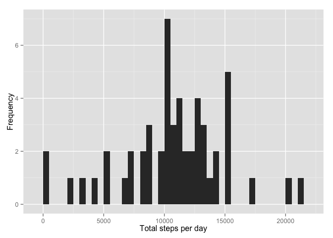
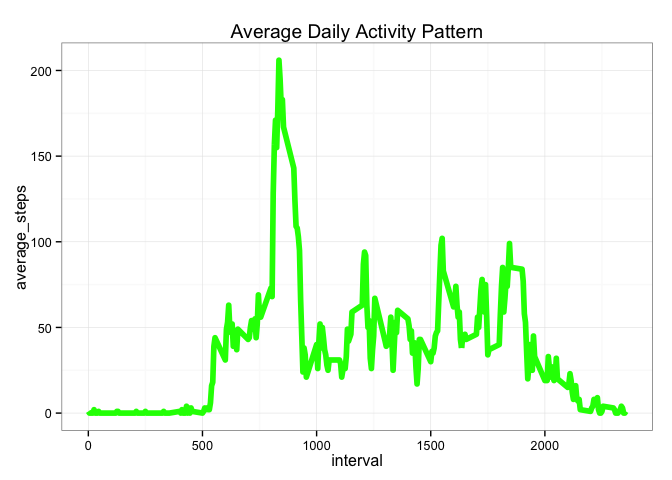
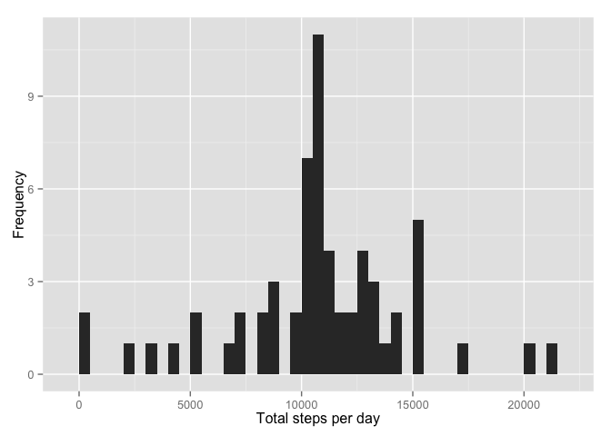
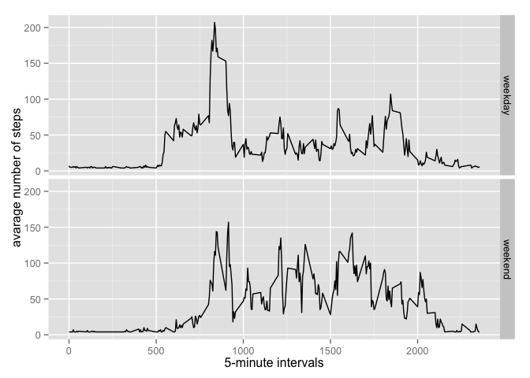

# Reproducible Research: Peer Assessment 1
Jon Moore  


## Loading and preprocessing the data

1. Load the data.

```r
activity_data <- read.csv("activity.csv", header=TRUE, sep=",", colClasses = c("numeric", "character", "numeric"))
```

2. Process/transform the data.

```r
activity_data$date <- as.Date(activity_data$date, format= "%Y-%m-%d")
activity_data$interval <- as.factor(activity_data$interval)
```


## What is mean total number of steps taken per day?

1. Calculate total number of steps per day.


```r
mean_steps_day <- tapply(activity_data$steps, activity_data$date, sum, na.rm=FALSE)
```

2. Make a histogram of the total number of steps taken per day.


```r
library(ggplot2)
qplot(mean_steps_day, xlab='Total steps per day', ylab='Frequency', binwidth=500)
```

 

3. Calculate the mean and median number of steps per day.


```r
steps_mean <- mean(mean_steps_day, na.rm=TRUE)

steps_median <- median(mean_steps_day, na.rm=TRUE)
```

- mean 

```r
steps_mean
```

```
## [1] 10766.19
```
- median 

```r
steps_median
```

```
## [1] 10765
```


## What is the average daily activity pattern?
1. Time series plot of he 5-minute interval (x-axis) and the average number of steps taken, averaged across all days (y-axis)

```r
average_activity <-aggregate(x=list(average_steps=activity_data$steps), by=list(interval=activity_data$interval), FUN=mean, na.rm=TRUE)
##need to convert to integers so it will plot 
average_activity$average_steps <- as.integer(average_activity$average_steps)
average_activity$interval <- as.numeric(as.character(average_activity$interval))
ggplot(average_activity, aes(x = interval, y = average_steps)) + geom_line(color="green", size=2) + labs(title="Average Daily Activity Pattern") + theme_bw()
```

 

2. 5 minute interval containing the most steps on average.


```r
average_activity[which.max(average_activity$average_steps),]
```

```
##     interval average_steps
## 104      835           206
```

## Imputing missing values

1. Total number rows with NAs.

```r
sum(is.na(activity_data))
```

```
## [1] 2304
```
2 -3 . Fill in all the missing values with the average steps for an interval and create new data set equivalent to original data set.

```r
fixed_na <- transform(activity_data, steps = ifelse(is.na(steps), mean(steps, na.rm=TRUE),steps))
str(activity_data)
```

```
## 'data.frame':	17568 obs. of  3 variables:
##  $ steps   : num  NA NA NA NA NA NA NA NA NA NA ...
##  $ date    : Date, format: "2012-10-01" "2012-10-01" ...
##  $ interval: Factor w/ 288 levels "0","5","10","15",..: 1 2 3 4 5 6 7 8 9 10 ...
```

```r
str(fixed_na)
```

```
## 'data.frame':	17568 obs. of  3 variables:
##  $ steps   : num  37.4 37.4 37.4 37.4 37.4 ...
##  $ date    : Date, format: "2012-10-01" "2012-10-01" ...
##  $ interval: Factor w/ 288 levels "0","5","10","15",..: 1 2 3 4 5 6 7 8 9 10 ...
```

4a. Histogram of the total number of steps taken each day.

```r
mean_steps_fixed <- tapply(fixed_na$steps, fixed_na$date, sum, na.rm=FALSE)
qplot(mean_steps_fixed, xlab='Total steps per day', ylab='Frequency', binwidth=500)
```

 

4b. Calculation of the mean and median steps per day.

```r
mean_fixed <- mean(mean_steps_fixed, na.rm=TRUE)
mean_fixed
```

```
## [1] 10766.19
```

```r
median_fixed <- median(mean_steps_fixed, na.rm=TRUE)
median_fixed
```

```
## [1] 10766.19
```
The results are different after replacing NAs.
Before:  
*Mean = 10766.19  
*Median = 10765  
After:  
*Mean = 10766.19  
*Median = 10766.19
        
## Are there differences in activity patterns between weekdays and weekends?

1. Create new factor variable for weekdays and weekends.

```r
fixed_na$dateType <-  ifelse(as.POSIXlt(fixed_na$date)$wday %in% c(0,6), 'weekend', 'weekday')
fixed_na$dateType <- as.factor(fixed_na$dateType)
```
2. Panel Plot for Time Series Weekdays vs. Weekends.

```r
average_activity_fixed <- aggregate(steps ~ interval + dateType, data=fixed_na, mean)
### need to coerce to integers to plot
average_activity_fixed$steps <- as.integer(average_activity_fixed$steps)
average_activity_fixed$interval <- as.numeric(as.character(average_activity_fixed$interval))
### make the plot
ggplot(average_activity_fixed, aes(interval, steps)) +  geom_line() + 
facet_grid(dateType ~ .) + xlab("5-minute intervals") +  ylab("avarage number of steps")
```

 
